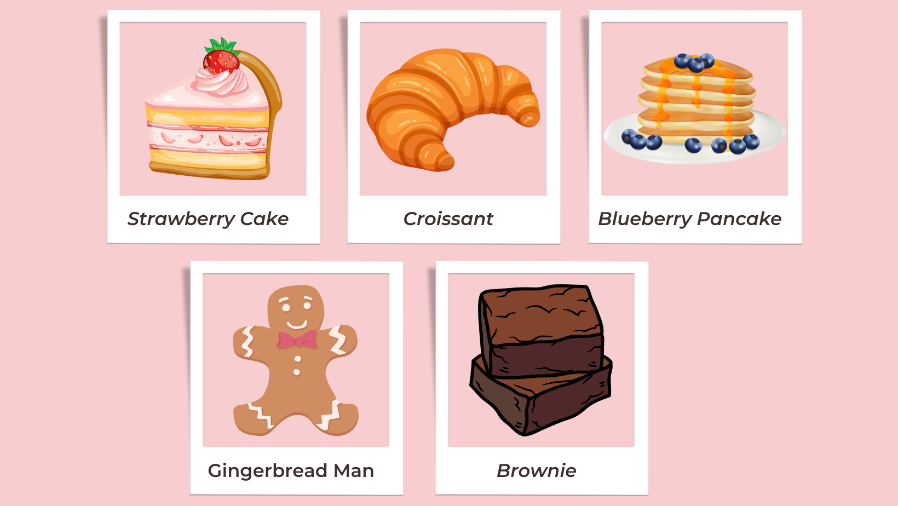
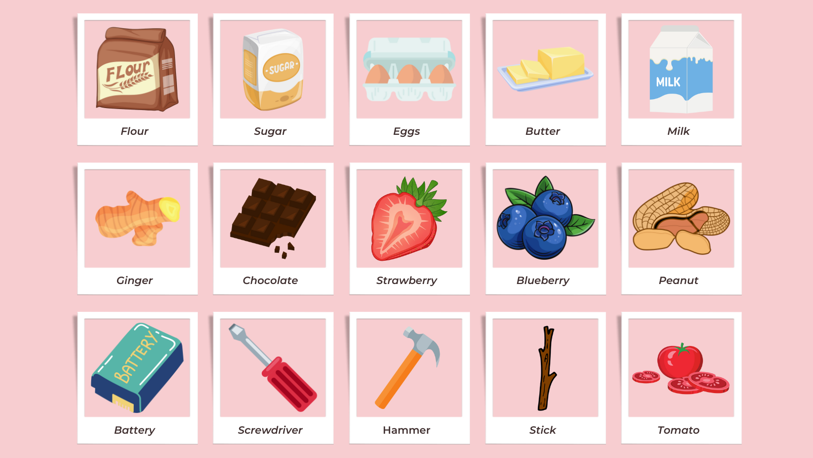

# Guess the right ingredient! An ingredient guessing game!

## Table of contents
* [Introduction](#introduction)
* [Technologies used](#technologies-used)
* [Setup and Launch](#setting-up-and-launching-the-game)
* [Project Status](#project-status)
* [Sources](#sources)
* [Preview Images](#preview-images)


## Introduction
This project is an ingredient guessing game where the user guesses one correct ingredient from a dessert recipe from 3 ingredient options provided.

## Technologies used
This project has been coded in python. It uses the open source pygame library.

## Setting up and launching the game
To launch the game you first need to: [Install Pygame](https://www.pygame.org/wiki/GettingStarted)

Then you can either:  
  ### a. Open the recipe_game.ipynb in JupyterNotebook and run all the code  
  ```
    $ cd ../RECIPE_GAME
    $ jupyter notebook
  ```
### OR   
  ### b. Navigate to the folder in your terminal then type or paste the following: 
  ```
    $ cd ../RECIPE_GAME
    $ python3 recipe_game.py
  ```

## Project Status
This project has been completed and there are no more planned changes.

## Sources 
Significant inspiration came from: [Python Programming's Pygame Tutorial](https://pythonprogramming.net/pygame-python-3-part-1-intro/)
  
## Preview images






